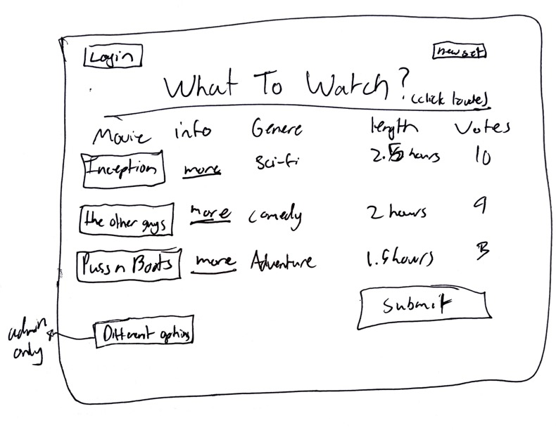

# Startup
## Movie Rankings
#### Concept
If you have ever sat with a significant other or a group of friends and wanted to descied on what movie to watch look no further. The What To Watch? movie website provides 3 random choices from our list of clasics for you and your friends to vote on. Web sockets allow you and your friends to communicate before you get together and descide on what to watch. Once you all choose your prefered movie you can finally get to watching a show and no one can complain since they picked it.

#### Features
- Secure login using authentication via HTTPS 
- Ability to start a vote and roll for random movies
- Displays choices of 3 movies
- Voters rank their choices
- Totals votes from all users in realtime
- Ability for a user to lock in their top three
- Results are stored
- Ability for admin to re roll movies if they dont like any of the choices

3.13.218.29 elastic IP
Setting a Record on a Route 53 links the ip address to the domain name

edit caddy to allow for https access on the EC2 instance by SSH
sudo vi caddy 
sudo service caddy restart

ssh -i ~samuel/260.pem ubuntu@3.13.218.29
chmod  600 /Users/samuel/Downloads/260.pem
./deployWebsite.sh -k ~samuel/260.pem -h whatshouldwewatch.click

#### Simon HTML Assignment
html href is super usefull 
I also learned alot about page formatting including the headers and the footers.
I learned about svg and how to format the shapes and make custom buttons

#### Simon CSS Assignment
Learned what a containter is in bootstrap and how a fluid container is one that spans the whole width
Learned that the classes in bootstrap are really important to know.
Border-radius to set a buton to change its shape (to a circle for example)
For sure study bootstrap classes as well as some css properties from the simon page
The nav component is super usefull

#### Startup HTML and CSS Assignment
I learned more about float and auto like using auto to put things in places I need
I also learned alot about styling in line comments as well as using the column and row classes for bootstrap
./deployFiles.sh -k ~samuel/260.pem -h whatshouldwewatch.click -s startup
I also learned about how important it is to seperate portions of you html code to prevent style errors

#### Simon JS Assignment
I learned how to use sounds in my application
I also learned how to use await functions for javascript in more depth
I have used local store on dash before but not accessing via  localStorage.setItem("userName", nameEl.value);
I learned how to include it in my html using the script html headder
I also learned about how to restrict what users can do while it loads.

#### Startup JS Assignment
voteEl.addEventListener('click', () => this.incrementVote(voteEl)) to be able to add a button that accesses its own value in js
I learned that the difference between length and elements matters in for loops and what each one means
When doing element you need to add an i and a value value since it will assign both to one variable and cause problems
I learned that not having strict types can be confusing
I learned how to update the DOM and dynamically name and access things through the DOM

https port 443

pals before married 

.sdfklj slects class
#selects id 
div selects type